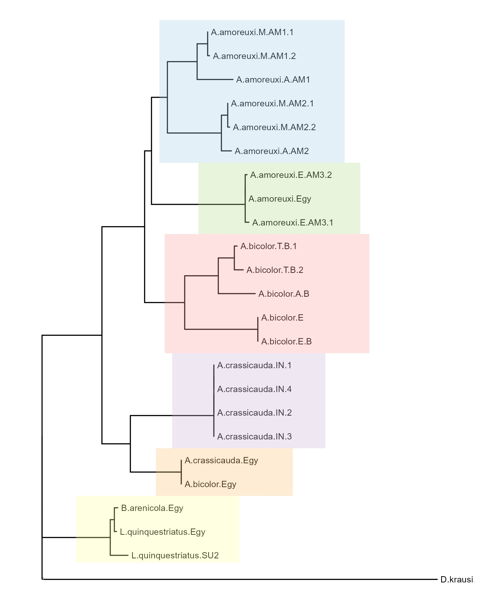
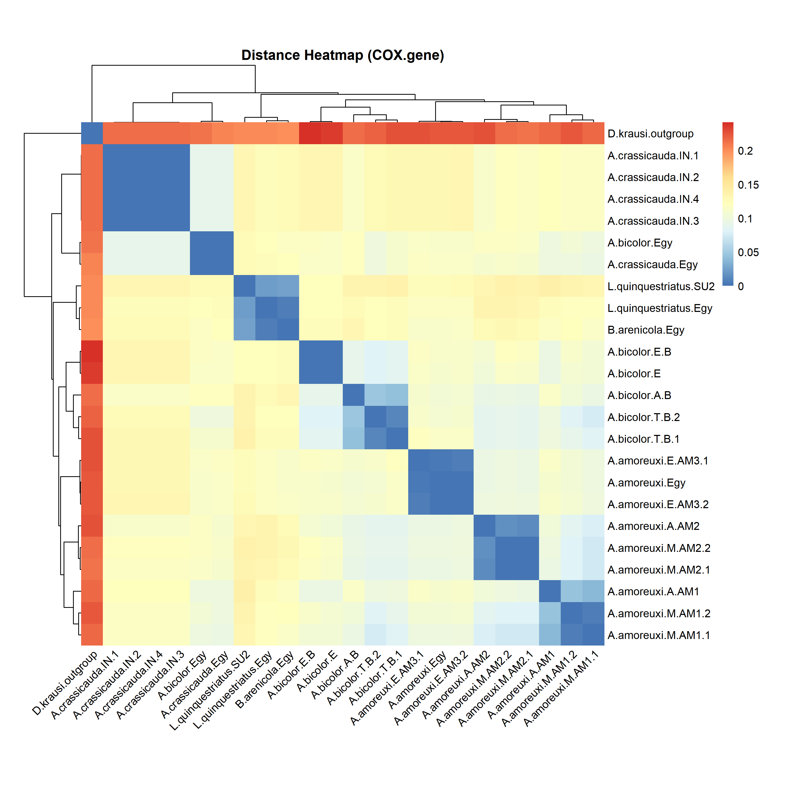
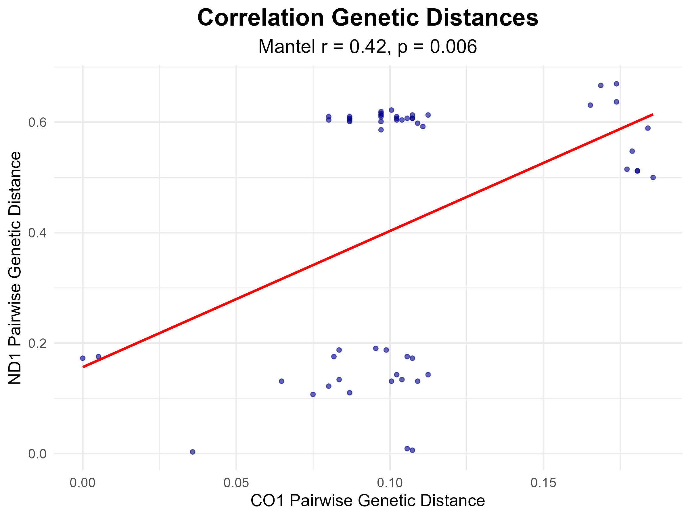
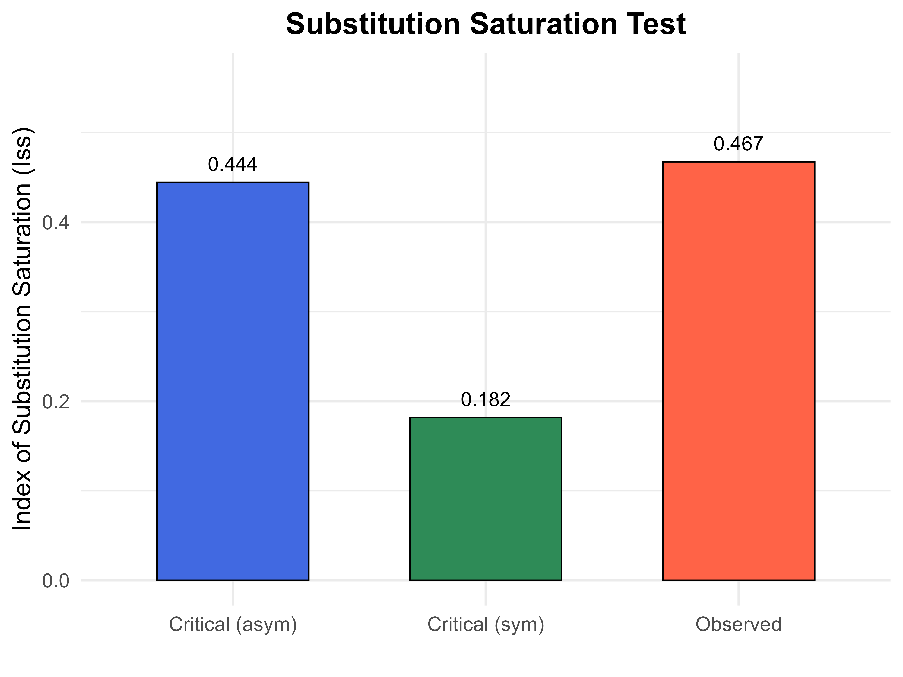

**# Scorpion Phylogeny \& Population Genetics**

**#\*\* Author**

Assistant Lecturer: Shorouk Aldeyarbi  

Faculty of Science, Port Said University, Egypt  

**#\*\* Related Publication**

Evaluating cytochrome C oxidase subunit 1 and NADH dehydrogenase 1 mitochondrial genes for five Buthidae scorpions.

&#x20;                                        (DOI: 10.7324/JABB.2026.272599)

**#\*\* Overview**

This project performs phylogenetic and population genetic analyses of Buthidae scorpions using mitochondrial markers:

\- Cytochrome Oxidase I (COI)

\- NADH Dehydrogenase 1 (ND1)

**#\*\* Methods**

\- Multiple Sequence Alignment (DECIPHER)

\- Genetic Distance Analysis (TN93 model)

\- Phylogenetic Tree Reconstruction

\- Mantel Test (Distance Correlation)

\- Substitution Saturation Analysis (Iss)

\- Base Composition Analysis

**#\*\*  Outputs**

\- Genetic distance heatmaps

\- Phylogenetic trees

\- Mantel correlation plots

\- Saturation test plots

**#\*\* Requirements**

***R packages***:ape, DECIPHER, ggtree, pheatmap, vegan, adegenet, hierfstat, seqinr

**#\*\* Structure**

\- `DATA/` → raw sequences and trees  

\- `scripts/` → analysis scripts  

\- `outputs/` → figures  

**#\*\* Notes**

COI showed higher phylogenetic resolution compared to ND1, which exhibited substitution saturation.

#** Results

### Phylogenetic Tree (COI)

### Genetic Distance Heatmap

### Mantel Test

Outputs/Iss_Test_plot.png

